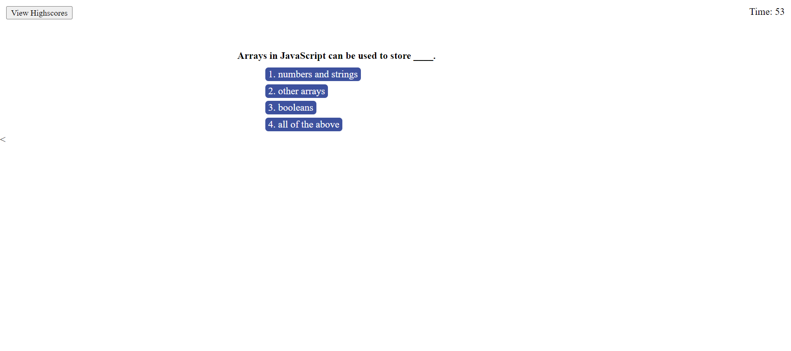

# challenge4-codeQuiz

## Description

The motivation for the project was to have time based quiz about JavaScript topics.
This project was undertaken to better learn web APIs and their application.
The created quiz is a time based quiz that once an answer is selected, presents new prompts and potential answers. If the wrong answer to a prompt is selected. Time is removed from the alloted time. After time runs out, the user can provide their initials and save their score.
Through this project a better understanding of API element and a much better understanding of how to manipulate scope between functions.

## Screenshot

## Webpage

[Link to published Horiseon webpage](https://solomon-coding.github.io/challenge4-codeQuiz/)

## Credits

`GoFullPage` extension was used to to take a screenshot of the webpage.

## License

None